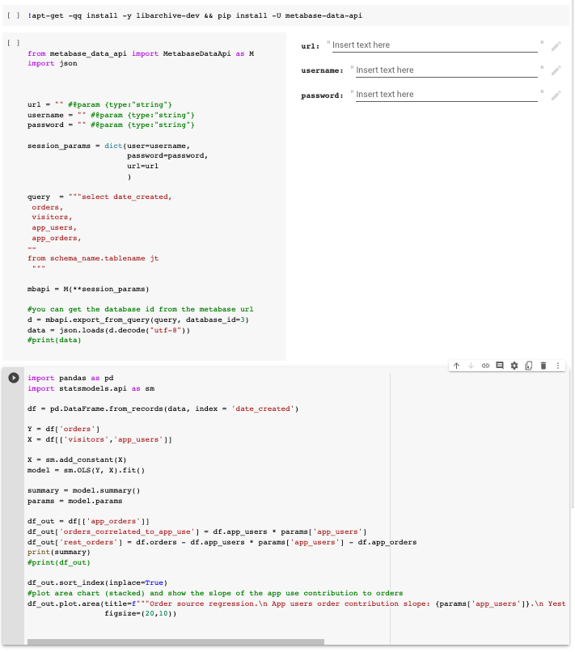

# Why?

## Python notebook access
This package was created to enable reading data from Metabase into a python notebook for further analysis.

It's a way to provide business users with access to data in complex analyses.

For example, a product manager user may refresh an experiment evaluation or a sankey diagram by using only their metabase credentials.

Or, a marketer could use a notebook that their data team made, to get user segmentation data and push it to Mailchimp or Facebook audiences.

Possible uses:
* Adding notebook-based analyses such as a/b testing significance calculators or data based attribution models
* Adding complex visualisations such as sankey diagrams
* Programmatic access to data for other parties (via metabase access management) means you can easily manage access in metabase rather than database.

## Credential management, easy authentication and querying
The advantage over going directly to the db are :
* Unified query method: You can query in the same way a card that reads data from Google Analytics or a database
* Unified access control: Access to data can be managed in metabase for sources or even individual questions. If metabase reads from multiple source systems, this also reduces #nr of credentials.

Typical use cases are:
* Simple authentication and querying: Metabase is likely to be publicly accessible (as opposed to data warehouses that might be VPC only). Authentication is handled and does not require any complex flows.
* Possiblity to consume "drag and drop" queries created in Metabase: A non tech user could create and maintain a data feed.


# Examples:
`pip install metabase-data-api`
see the examples folder




code snippet:
```
import pandas as pd
from metabase_data_api import MetabaseApi as M
import json

session_params = dict(user='name@company.ai',
                      password='demopass1',
                      url='https://yourteam.metabaseapp.com/'
                      )

mb_api = M(**session_params)

query = 'SELECT 12 as col'

#get raw file data via export
d = mb_api.export_from_query(query, database_id=4)

json.loads(d.decode("utf-8"))

df = pd.DataFrame.from_records(d)


print(df)
#   col
#0   12
```


# Limits
The export method uses the file download functionality which is ***limited to 1m rows***.

The get_ methods are calling the same endpoints that are used by metabase for its own charting and are ***limited to 2k rows of results***


