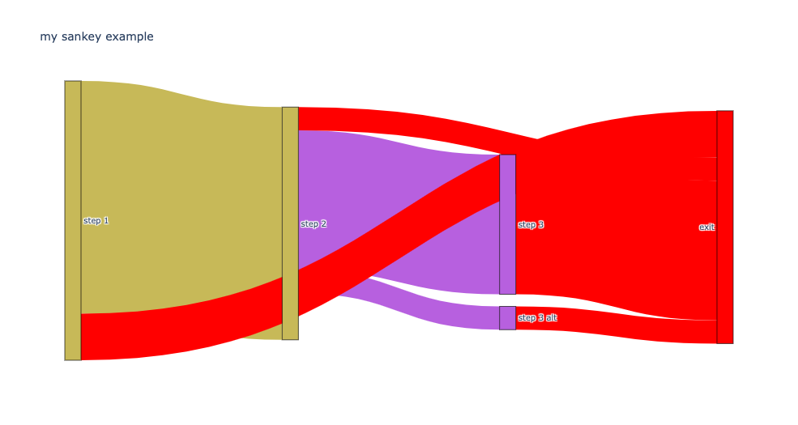

#Regression example

This is an example of a sankey diagram for user flow

Example case (theoretical):

Assume you need to track any kind of non-linear journey and quantify and identify

* Snag points in the journey
* The happy path

